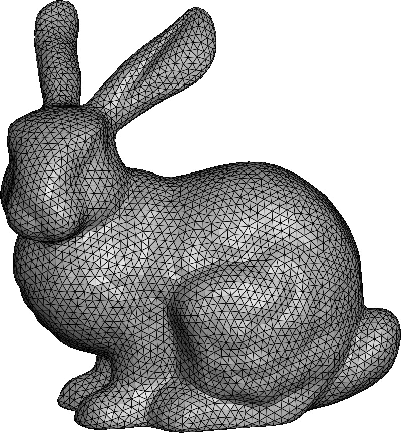

<figure markdown>
  { width="400" }
  <figcaption>A triangular surface mesh</figcaption>
</figure>

## SurfaceMesh

::: mouette.mesh.datatypes.surface.SurfaceMesh
    options:
      heading_level: 3

## Surface Connectivity

::: mouette.mesh.datatypes.surface.SurfaceMesh._Connectivity
    options:
      heading_level: 3