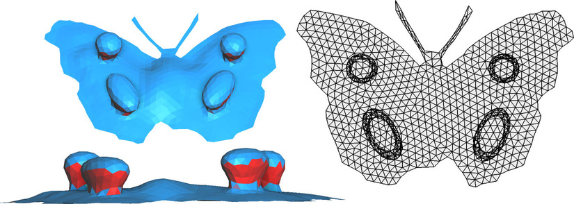

<figure markdown>
  { width="600" }
  <figcaption>Initial flattening of a butterfly model (with folds in red)</figcaption>
</figure>
<figure markdown>
  { width="600" }
  <figcaption>Final result</figcaption>
</figure>


Usage:
```python
import mouette as M
from mouette.processing import parametrization

mesh = M.mesh.load("path/to/mesh")
cot_emb = parametrization.CotanEmbedding(mesh, [options])()
```

or, alternatively:
```python
cot_emb = parametrization.CotanEmbedding(mesh, [options])
cot_emb.run()
```

:::mouette.processing.parametrization.cotan_emb.CotanEmbedding