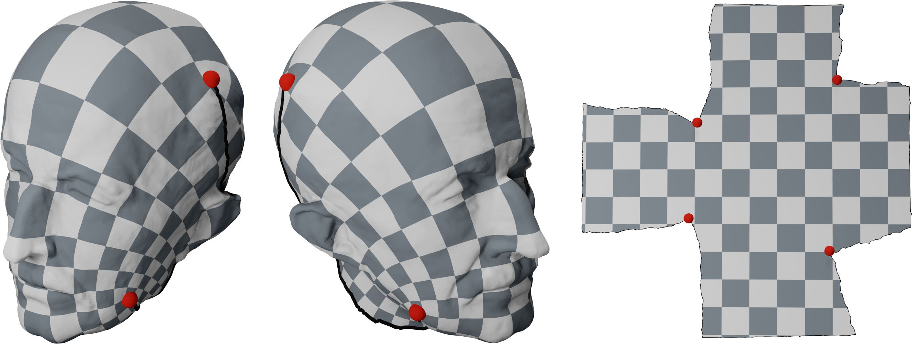

Cone parametrization methods are a way to compute the parametrization of any surface with any topology. To understand the intuition that motivates them, one can think of a parametrization firstly as a process that displaces the curvature of a surface from its original distribution to zero everywhere except on the boundary. In the case of conformal maps, this idea is expressed by the Yamabe equation, that links the conformal parametrization, described by a scale factor $u$, to the original and target Gaussian curvatures $K$ and $\hat{K}$ by:

$$Lu = K - \hat{K}$$

This curvature displacement is the source of the parametrization's distortion and needs to be minimal in some sense. In an effort to reduce distortion, one can try to find a suitable target curvature distribution $\hat{K}$ such that, for instance, the amplitude of $u$ is minimized. This introduces specific vertices called _cones_ (also called _singularities_) with non-zero angle defect in the parametrization. Cone parametrization therefore aim at finding a sparse set of cones that concentrate the whole curvature of the considered surface. From such a distribution, it is possible to retrieve $uv$-coordinates and an embedding in the plane by forcing these cones to lay on the boundary of the parametric domain. More precisely, given a set of cone vertices $S \subset V$, the following general algorithm can be applied:

- Perform cuts on edges in order to link every cone vertex;
- Eventually perform additional cuts along non-contractible cycles in order to retrieve a disk topology;
- Apply any parametrization algorithm to the cut mesh.

<figure markdown>
  { width="700" }
  <figcaption>Max Planck's bust model, mapped to the plane using a conformal cone parametrization. Four cones of defect pi/2 (red points) are placed on the model to reduce distortion</figcaption>
</figure>

## ConformalConeParametrization

:::mouette.processing.parametrization.cone_param.ConformalConeParametrization
    options:
        heading_level: 3

## SingularityCutter
:::mouette.processing.cutting.SingularityCutter
    options:
        heading_level: 3