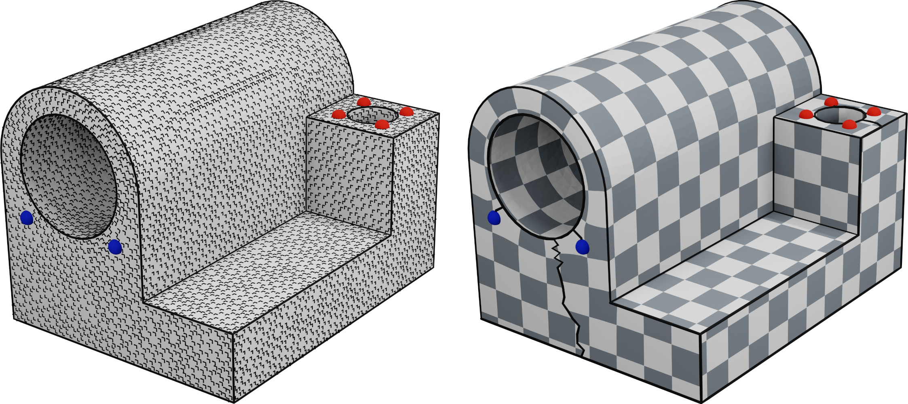

A frame field on a surface mesh can be thought as gradient vectors of some scalar functions. Retrieving a parametrization involves "integrating" this field to recover those scalar coordinates $u$ and $v$.

The algorithm proceeds as follows:

- Smooth a frame field on faces of a mesh
 
- Determine the singularities and cut along seams to recover a disk topology
 
- Brush the frame field: determine which branch of the cross will correspond to $u$ and to $v$ at each face

- Integrate the two vector fields: find the two functions $u$ and $v$ whose gradient match the two vector fields in the least-square sense.

<figure markdown>
  { width="750" }
  <figcaption>Left: Brushed frame field defined on the faces of a CAD model. Singularities are depicted in red (+pi/2) and blue (-pi/2). Right: seamless parametrization computed by integrating the frame field</figcaption>
</figure>


## FrameFieldIntegration

#### Usage
```python
ff = M.framefield.SurfaceFrameField(mesh, "faces") 
# /!\ Integration is supported only for a frame field defined on faces
ff_param = M.parametrization.FrameFieldIntegration(ff, verbose=True)
ff_param.run()
uvs = mesh.face_corners.get_attribute("uv_coords")
```

:::mouette.processing.parametrization.ff_integration.FrameFieldIntegration
    options:
        heading_level: 3