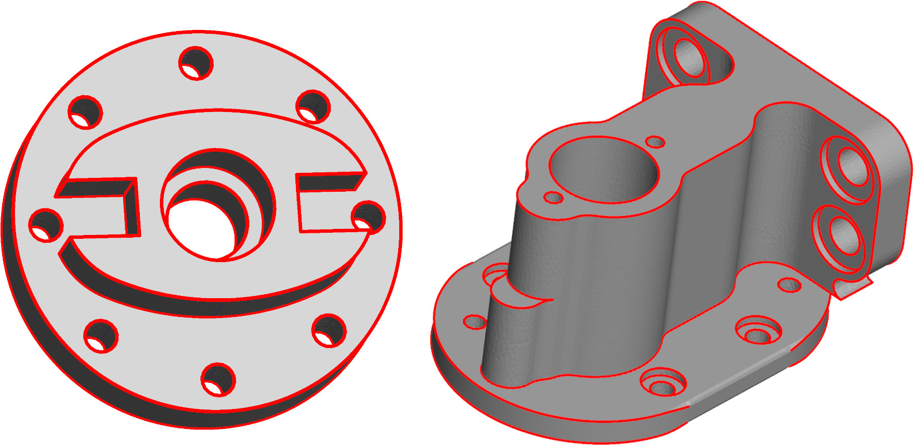

Detecting feature edges of a surface mesh is done in `mouette` in the `FeatureEdgeDetector` class. This class encapsulates various strategies of detection and stores the result for a given mesh.

#### Usage
```python
fed = FeatureEdgeDetector([options])
fed.detect(mesh)
```

or

```python
fed = FeatureEdgeDetector([options])(mesh) # directly calls detect
```

This fills the various container attributes that can be accessed in the `FeatureEdgeDetector` class.

<figure markdown>
  { width="600" }
  <figcaption>Feature edge detection on CAD models</figcaption>
</figure>


:::mouette.processing.features
    options:
        filters:
        - "!PointCloud"
        - "!PolyLine"
        - "!SurfaceMesh"
        - "!VolumeMesh"
        - "!check_argument"