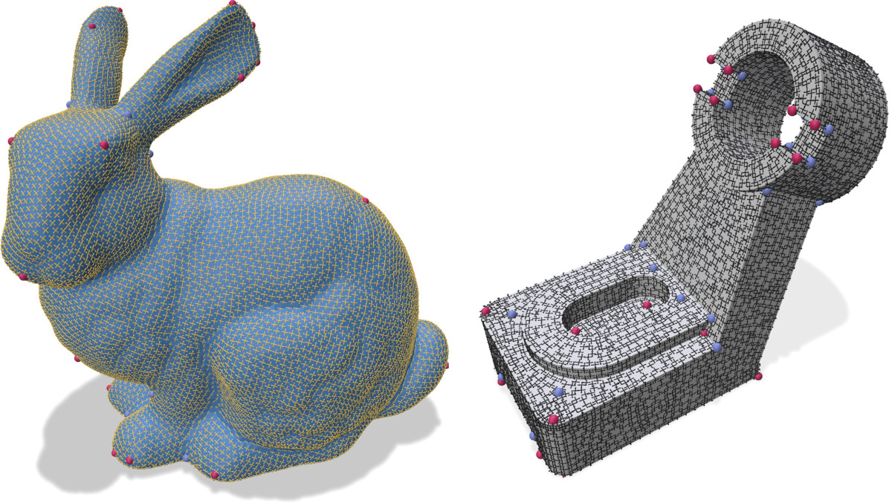

A frame field is a set of directions that live in the tangent space of a manifold. On a mesh, it can be represented as a set of vectors for each element (vertex/face/cell) on which it is defined.

<figure markdown>
  { width="700" }
  <figcaption>Smooth frame field on the bunny model and on a CAD mesh</figcaption>
</figure>

A demo of mouette's frame field algorithms visualized in [Polyscope](https://polyscope.run/py/) can be found [here](https://github.com/GCoiffier/Frame-Fields-Demo)


## The FrameField base class

Mouette implements frame fields via the abstract base class `FrameField`. This base class is instanciated with various algorithms using higher level functions.

#### Framefield optimization

Given a `FrameField` object initialized by some external function, the user can run the smoothing algorithm using the `.run()` method. Alternatively, a `FrameField` object is callable :

```python
ff()
ff.run() # produces similar results
```

#### Variables access

`FrameField` objects are iterable. Indexing a frame field returns the representation of the frame at the given index. For 2D frame fields, this representation is a complex number. For 3D frame fields, it is a numpy array of shape (9,) representing the corresponding [L4 spherical harmonics](../../Geometry/spherical_harmonics.md).

```python
ff[7] # returns the representation of the frame for element (vertex/face/cell )
```

#### Singularity flagging

The `.flag_singularities()` method of the `FrameField` class allow to detect any singular point inside the frame field. When the boundary of the domain is constrained, those singularity points are bound to appear in 2D (due to the [Poincaré-Hopf theorem](https://en.wikipedia.org/wiki/Poincar%C3%A9%E2%80%93Hopf_theorem)). In 3D, the singularities are no longer ponctual, but form a network of lines called a singularity graph.

#### Export and Visualization

The `export_as_mesh()` method of the `FrameField` class outputs frames either as little crossed in 2D or little cubes in 3D for visualization purposes.

## SurfaceFrameField

#### Usage
```python
from mouette import framefield
ff = framefield.SurfaceFrameField(mesh, "faces", 
      order=4, features=True, 
      verbose=True, n_smooth=10, 
      smooth_attach_weight=0.2, 
      cad_correction=True)
```

::: mouette.processing.framefield.SurfaceFrameField


## PrincipalDirections

The principal directions of curvature are the two tangent eigenvectors of the curvature tensor of a surface 
([https://en.wikipedia.org/wiki/Principal_curvature](https://en.wikipedia.org/wiki/Principal_curvature)). In practice, they are always orthogonal to each other and point towards the directions where curvature varies the fastest and the slowest.

#### Usage
```python
from mouette import framefield
ff = framefield.PrincipalDirections(mesh, "vertices", features=True, 
      verbose=True, n_smooth=3, smooth_attach_weight=0.5)
ff.run()
ff.flag_singularities()
```

:::mouette.processing.framefield.PrincipalDirections


## VolumeFrameFields

To represent the frames in a 3D frame field, we use the [L4 Spherical Harmonics](mouette.geometry.SphericalHarmonics).

#### Usage
```python
from mouette import framefield
ff = framefield.VolumeFrameField(mesh, "vertices", 
      features=True, n_smooth=10., 
      smooth_attach_weight=0.1, 
      verbose=True)
ff.run()
ff.flag_singularities()
```

:::mouette.processing.framefield.VolumeFrameField


<!-- ## Saving from a file

save as a `.frame` file:

```
FRAME
nframes
a1x a1y a1z b1x b1y b1z c1x c1y c1z
a2x a2y a2z b2x b2y b2z c2x c2y c2z
...
anx any anz bnx bny bnz cnx cny cnz
```

## Reading from a file

```python
import mouette as M
from mouette.processing import VolumeFrameField

m = M.mesh.load("path/to/mesh")
ff = VolumeFrameField(m, "cells", verbose=True)
ff.read_from_file("path/to/frame")
ff.flag_singularities() 
ff_mesh = ff.export_as_mesh()
M.mesh.save(ff_mesh, "ff.mesh")
M.mesh.save(ff.singularity_graph, "singularity_graph.mesh")
``` -->