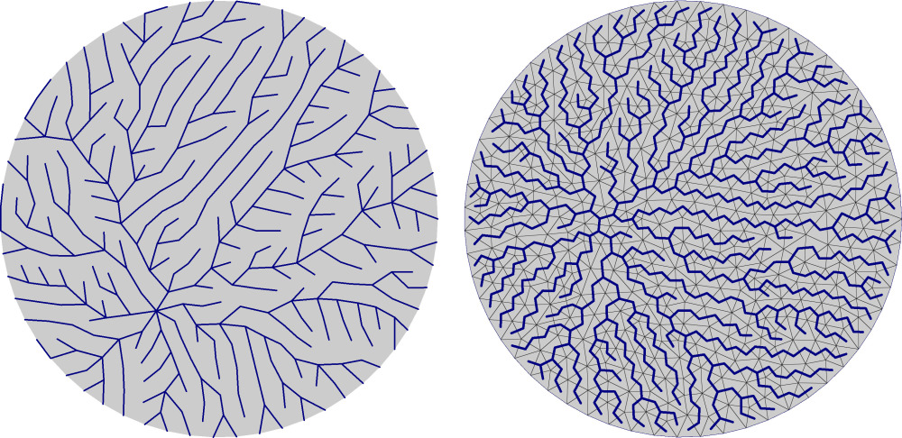

#### Usage
```python

data = M.mesh.load("my/super/data.mesh")

tree = M.processing.trees.EdgeSpanningTree(data)() # the () calls tree.compute()
for (parent,child) in tree.traverse():
  print(parent,"->",child)
```

<figure markdown>
  { width="600" }
  <figcaption>Spanning trees of a disk mesh (left: EdgeSpanningTree, right: FaceSpanningTree)</figcaption>
</figure>


## EdgeSpanningTree

::: mouette.processing.trees.edge_sp.EdgeSpanningTree
    options:
      heading_level: 3

## EdgeMinimalSpanningTree

::: mouette.processing.trees.edge_sp.EdgeMinimalSpanningTree
    options:
      heading_level: 3

## EdgeSpanningForest

::: mouette.processing.trees.edge_sp.EdgeSpanningForest
    options:
      heading_level: 3

## FaceSpanningTree

::: mouette.processing.trees.face_sp.FaceSpanningTree
    options:
      heading_level: 3

## FaceSpanningForest

::: mouette.processing.trees.face_sp.FaceSpanningForest
    options:
      heading_level: 3

## CellSpanningTree

::: mouette.processing.trees.cell_sp.CellSpanningTree
    options:
      heading_level: 3

## CellSpanningForest

::: mouette.processing.trees.cell_sp.CellSpanningForest
    options:
      heading_level: 3