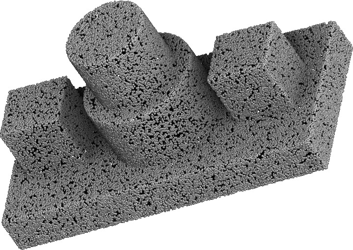

<figure markdown>
  { width="400" }
  <figcaption>Point Cloud of a CAD model</figcaption>
</figure>

A Point Cloud is a simple collection of points in $\mathbb{R}^3$

:::mouette.mesh.datatypes.pointcloud