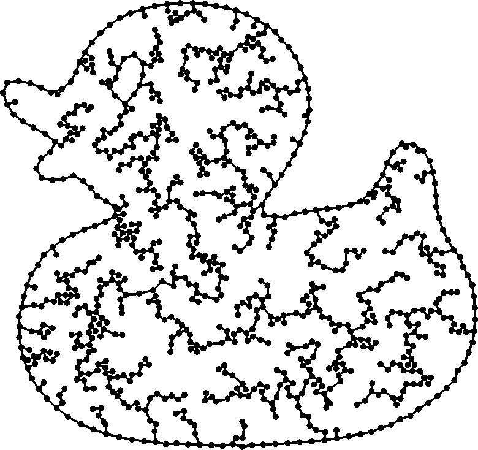

Polylines are made of vertices (points in 3D space) and edges linking them. They allow to embed a graph in R³ and visualize it.

<figure markdown>
  { width="400" }
  <figcaption>Example of a polyline</figcaption>
</figure>

## Polyline Class

:::mouette.mesh.datatypes.linear.PolyLine

## Polyline Connectivity

:::mouette.mesh.datatypes.linear.PolyLine._Connectivity