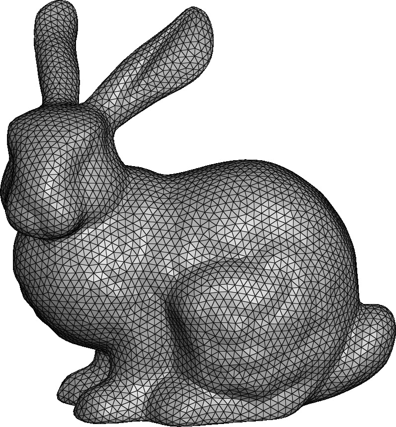

<figure markdown>
  { width="400" }
  <figcaption>A triangular surface mesh</figcaption>
</figure>

## SurfaceMesh Class

:::mouette.mesh.datatypes.surface.SurfaceMesh

## Surface Half edges

:::mouette.mesh.datatypes.surface.SurfaceMesh._HalfEdgeStructure

## Surface Connectivity

:::mouette.mesh.datatypes.surface.SurfaceMesh._Connectivity