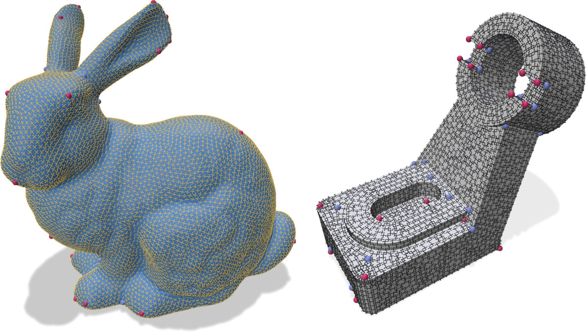

A frame field is a set of directions that live in the tangent space of a manifold. On a mesh, it can be represented as a set of vectors for each element (vertex/edge/face/cell) on which it is defined.

<figure markdown>
  { width="700" }
  <figcaption>Smooth frame field on the bunny model and on a CAD mesh</figcaption>
</figure>

A demo of mouette's surface frame field algorithms visualized in [Polyscope](https://polyscope.run/py/) can be found [here](https://github.com/GCoiffier/Frame-Fields-Demo)


## The FrameField base class

Mouette implements frame fields via the abstract base class `FrameField`. This base class is instanciated with various algorithms using higher level functions.

### Framefield smoothing

Given a `FrameField` object initialized by some external function, the user can run the smoothing algorithm using the `.run()` method. Alternatively, a `FrameField` object is callable:

```python
ff.run() 
ff() # produces similar results
```

### Variables access

`FrameField` objects are iterable. Indexing a frame field returns the representation of the frame at the given index. For 2D frame fields, this representation is a complex number. For 3D frame fields, it is a numpy array of shape (9,) representing the corresponding [L4 spherical harmonics](../../utilities/spherical_harmonics.md).

```python
ff[7] # returns the representation of the frame for element (vertex/face/cell )
```

### Singularity flagging

The `.flag_singularities()` method of the `FrameField` class allow to detect any singular point inside the frame field. When the boundary of the domain is constrained, those singularity points are bound to appear in 2D (due to the [Poincaré-Hopf theorem](https://en.wikipedia.org/wiki/Poincar%C3%A9%E2%80%93Hopf_theorem)). In 3D, the singularities are no longer ponctual, but form a network of lines called a singularity graph.

### Export and Visualization

The `export_as_mesh()` method of the `FrameField` class outputs frames either as little crossed in 2D or little cubes in 3D for visualization purposes.

## Frame fields in mouette

`mouette` implements different kinds of frame fields:

### 2D frame fields
- [Surface frame fields](./surface_ff.md) are orthogonal crosses on a surface mesh, either on its vertices, its edges or its faces
- [Principal directions of curvature](./curvature.md) follow the extrema of Gaussian curvature on a surface mesh

To work on curved surfaces, these frame field require the definition of a [discrete surface connection](./connection.md) which allows the comparison of elements in adjacent tangent spaces.

### 3D frame fields
- [Volume frame fields](./volume_ff.md) are 3D crosses defined inside a volume mesh, either on its vertices or its cells.