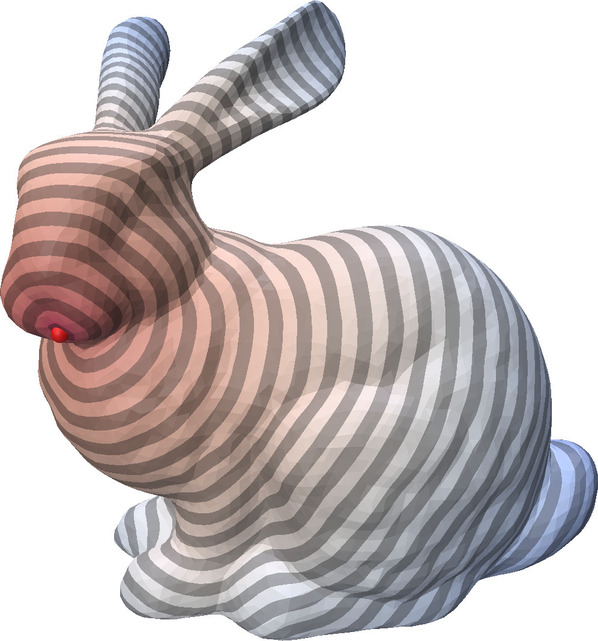

Given a surface mesh, the heat method solves a heat diffusion problem to compute geodesic distances to prescribed source points.


#### Usage
```python
heat_solver = M.processing.HeatMethodDistance(mesh)
distance = heat_solver.get_distance(source_points_list)
```

See a full example [here](https://github.com/GCoiffier/mouette/blob/main/examples/heat_method_distance.py).

<figure markdown>
  { width="300" }
  <figcaption>The distance from a point on the stanford bunny, computed using the heat method</figcaption>
</figure>


:::mouette.processing.heat_method
    options:
        filters:
        - "!PointCloud"
        - "!PolyLine"
        - "!SurfaceMesh"
        - "!VolumeMesh"
        - "!check_argument"