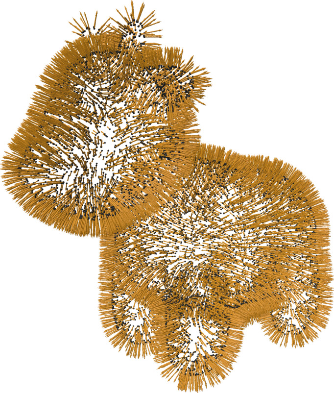

#### Usage
```python
nrml_estimator = PointCloudNormalEstimator([options])
nrml_estimation.run(mesh)
```

or

```python
nrml_estimator = PointCloudNormalEstimator([options])(mesh) # directly calls run
```

This fills the various container attributes that can be accessed in the `PointCloudNormalEstimator` class.

<figure markdown>
  { width="300" }
  <figcaption>Outward normal estimation on a point cloud of the spot model</figcaption>
</figure>


## PointCloudNormalEstimator
:::mouette.processing.point_cloud_utils.PointCloudNormalEstimator
    options:
        filters:
        - "!PolyLine"
        - "!SurfaceMesh"
        - "!VolumeMesh"
        - "!check_argument"