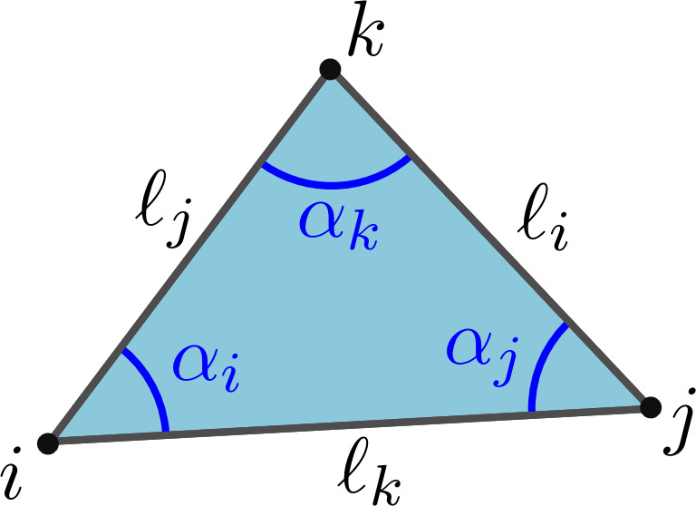
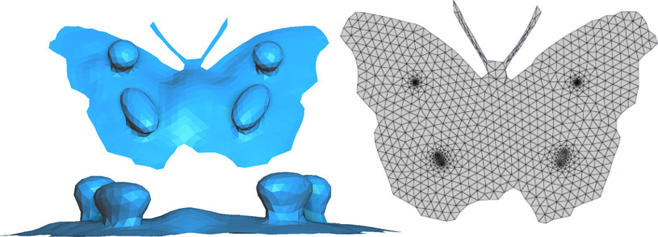

Given a triangulation $M=(V,T)$ of a disk-topology object and some initial $uv$-coordinates on the vertices of $M$, this method optimizes the $uv$-coordinates under fixed boundary so that no triangle is inverted in the final $uv$-mapping.

<figure markdown>
  { width="300" }
  <figcaption>Notations for triangle $T=(i,j,k)$</figcaption>
</figure>

The algorithms minimizes the energy $E_T$ per triangle, defined as:

$$E_T = D_T - A_T$$

where:

$$D_T = \displaystyle \begin{pmatrix} \cot(\alpha_i) & \cot(\alpha_j) & \cot(\alpha_k) \end{pmatrix} .
    \begin{pmatrix} 
      (u_j - u_k)^2 + (v_j - v_k)^2 \\ 
      (u_i - u_k)^2 + (v_i - v_k)^2 \\
      (u_i - u_j)^2 + (v_i - v_j)^2         
  \end{pmatrix}$$

$$A_T = \frac{1}{2} \det \begin{pmatrix} u_j-u_i & u_k-u_i \\ v_j-v_i & v_k-v_i \end{pmatrix}$$

The first term $D_T$ of this expression is the dot product between the vector of cotangents and the vector of opposite squared lengths. If the cotangents correspond to the angles made by $uv$-coordinates, then this quantity is exactly the unsigned area of triangle $T$. The other term is half the determinant of $uv$-coordinates of the triangle, that is to say the _signed_ area $A_T$ of triangle $T$. The energy we consider per triangle is simply the difference between the two.
    
This energy can be minimized in two ways:

#### The direct optimization

The first strategy to minimize the energy is to put everything inside a non-linear solver like L-BFGS. However, this optimization may result in cotangents that do not form valid triangles, hence we need to introduce the constraint:
$\cot(\alpha_i)\cot(\alpha_j) + \cot(\alpha_j)\cot(\alpha_k) + \cot(\alpha_k)\cot(\alpha_i) = 1$ for all triangles $T$.

Using Lagrange multipliers, we are able to reformulate the constrained problem as:

$$\min_{u,v} \sum_{T=(i,j,k)} \sqrt{2( \ell_i \ell_j + \ell_j \ell_k + \ell_k \ell_i) - \ell_i^2 - \ell_j^2 - \ell_k^2} \;-\, A_T$$

where $\ell_i = (u_j - u_k)^2 + (v_j - v_k)^2$ is the **squared** distance between $j$ and $k$ in parameter space. This means that the final energy only depends on the $uv$-coordinates.

#### The iterative approach

Alternatively, the energy can be minimized by iteratively solving linear systems involving a cotan-Laplacian, where the cotangent are updated at each step to match the cotangents given by the $uv$-coordinates:

$$\cot(\alpha_k) = \frac{ (u_i-u_k)(u_j-u_k) + (v_i-v_k)(v_j-v_k) }{(u_i-u_k)(v_j-v_k) - (u_j-u_k)(v_i-v_k)}.$$

This approach is more stable and provides good results in more cases, but the final parametrizations are close to conformal and thus can exhibit high area distortions.

#### Result

<figure markdown>
  { width="600" }
  <figcaption>Initial flattening of a butterfly model (with folds in red)</figcaption>
</figure>
<figure markdown>
  { width="600" }
  <figcaption>Final result with L-BFGS approach</figcaption>
</figure>
<figure markdown>
  { width="600" }
  <figcaption>Final result with iterative Tutte approach</figcaption>
</figure>

#### References
- [1] _Embedding a triangular graph within a given boundary_, Yin Xu, Renjie Chen, Craig Gotsman and Ligang Liu, Computer Aided Geometric Design (2011)
- [2] _[Global Parametrization Algorithms for Quadmeshing](https://hal.univ-lorraine.fr/tel-04346473v1)_, Guillaume Coiffier, PhD Manuscript (Chapter 3)

#### Usage

```python
import mouette as M

emb = M.parametrization.CotanEmbedding(mesh, uv_attributes, mode="bfgs")()
```
or, alternatively:

```python
emb = M.parametrization.CotanEmbedding(mesh, uv_attributes, mode="bfgs")
emb.run()
```

:::mouette.processing.parametrization.cotan_emb
    options:
        heading_level: 2
        filters:
            - "!PointCloud"
            - "!PolyLine"
            - "!SurfaceMesh"
            - "!VolumeMesh"
            - "!check_argument"