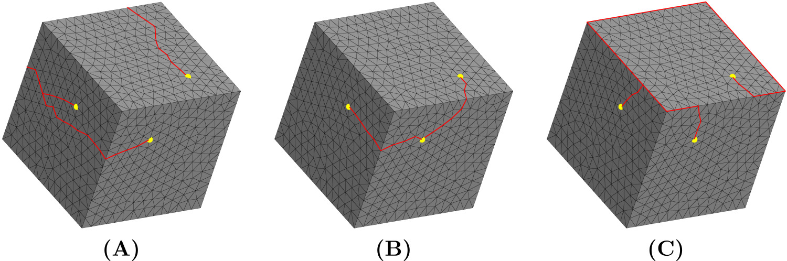

## SurfaceMeshCutter

Given a surface mesh and a set of edges, this utility class will perform cuts along the prescribed edges, disconnecting their two adjacent faces.

#### Usage
```python
cutter = SurfaceMeshCutter(mesh)
cutter.cut(edge_list)
```

or

```python
cutter = SurfaceMeshCutter(mesh)(edge_list) # directly calls cut
```

::: mouette.processing.cutting.SurfaceMeshCutter
    options:
        heading_level: 3
        filters:
            - "!PointCloud"
            - "!PolyLine"
            - "!SurfaceMesh"
            - "!VolumeMesh"
            - "!check_argument"

## SingularityCutter

Given some indices in the mesh, performs cuts on the same so that:  
1) every prescribed vertex becomes a boundary vertex  
2) the final mesh has disk topology.  

This utility class allows to define the discontinuities of a seamless global parametrization and go back and forth between the original mesh and the cut mesh.

Three strategies for computing the cuts are available:  
    - **(A) Simple strategy**: no heuristics. Computes a valid seam graph with no geometrical consideration.  
    - **(B) Shortest path strategy**: tries to minimize the total length of seams by encouraging cuts to follow shortest paths between singularities.  
    - **(C) Follow features strategy**: minimize the number of seam edges that do not belong to the feature graph (i.e. sharp edges) of the model. Requires to first run a [`FeatureEdgeDetector`](../feature_detection.md) on the mesh.  

<figure markdown>
  { width="700" }
  <figcaption>Illustration of the three cutting strategies</figcaption>
</figure>

#### Usage
```python
cutter = SingularityCutter(mesh, indices, strategy="shortest")
cutter.run()
```

::: mouette.processing.cutting.SingularityCutter
    options:
        heading_level: 3
        filters:
            - "!PointCloud"
            - "!PolyLine"
            - "!SurfaceMesh"
            - "!VolumeMesh"
            - "!check_argument"