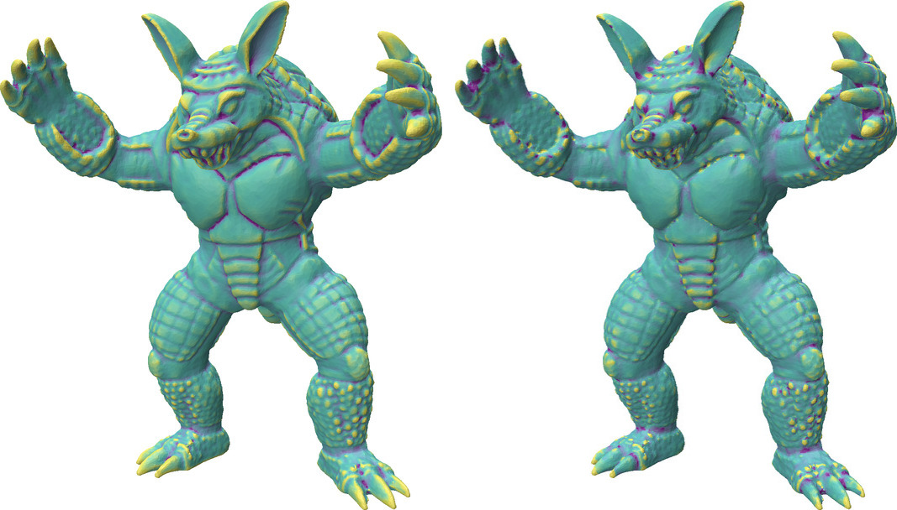

#### Usage
```python
shape_op = ShapeOperator(input_mesh)
shape_op.run()
print(shape_op[3]) # A 2x2 matrix representing the shape operator at vertex #3
```


<figure markdown>
  { width="600" }
  <figcaption>Mean curvature (left) and Gaussian curvature (right) on the Armadillo model</figcaption>
</figure>

## ShapeOperator
:::mouette.processing.shape_operator.ShapeOperator
    options:
        filters:
        - "!PolyLine"
        - "!SurfaceMesh"
        - "!VolumeMesh"
        - "!check_argument"