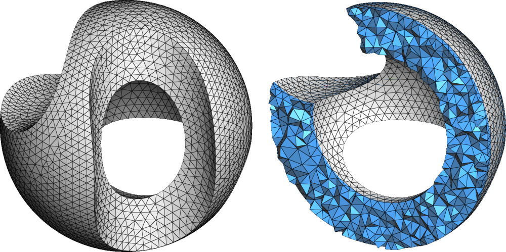

<figure markdown>
  { width="600" }
  <figcaption>A tetrahedral mesh</figcaption>
</figure>

## VolumeMesh

::: mouette.mesh.datatypes.volume.VolumeMesh
    options:
      heading_level: 3

## Volume Connectivity

::: mouette.mesh.datatypes.volume.VolumeMesh._Connectivity
    options:
      heading_level: 3