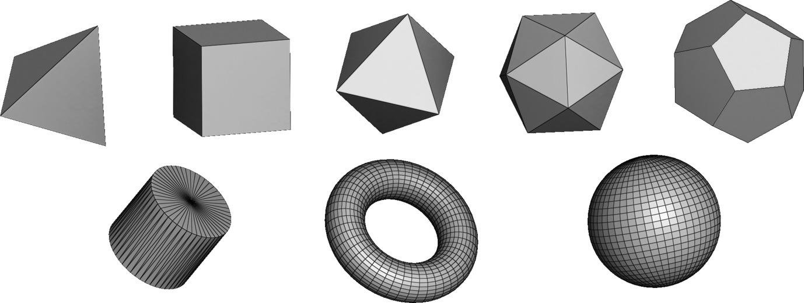

The `mouette.procedural` module implements various functions to generate surface meshes or various shapes directly from code

<figure markdown>
  { width="800" }
  <figcaption>Shapes generated procedurally with mouette</figcaption>
</figure>

## Procedural shapes

::: mouette.procedural.flat
    options:
      heading_level: 3
      members:
        - triangle
        - unit_triangle
        - quad
        - unit_grid

::: mouette.procedural.rings
    options:
      heading_level: 3
      members:
        - ring
        - flat_ring

::: mouette.procedural.shapes
    options:
      heading_level: 3
      members:
        - tetrahedron
        - hexahedron
        - hexahedron_4pts
        - axis_aligned_cube
        - octahedron
        - icosahedron
        - dodecahedron
        - cylinder
        - torus
        - sphere_uv
        - icosphere
        - sphere_fibonacci

## Polyline generation

::: mouette.procedural.polylines
    options:
        heading_level: 3
        members:
          - chain_of_vertices
          - vector_field

## Transformations

::: mouette.procedural.transformations
    options:
      heading_level: 3
      members:
        - spherify_vertices
        - cylindrify_edges

::: mouette.procedural.dual
    options:
      heading_level: 3
      members:
        - dual_mesh